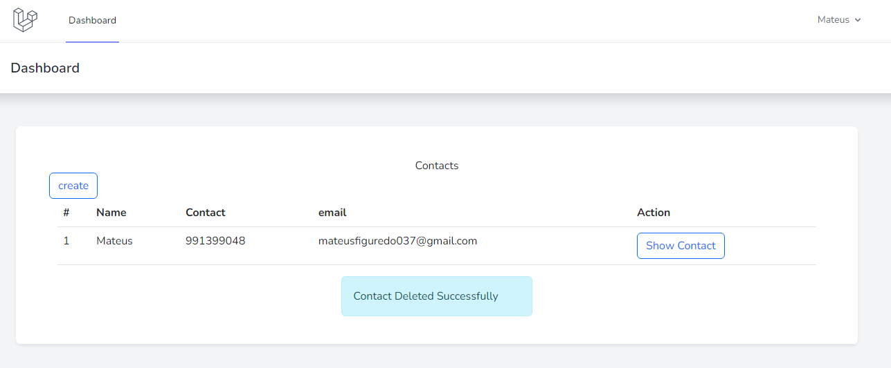
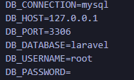

## Desafio

<p align="start">Crud Contact Manager</p>

<p align="start"></a></p>

``` 
Application Features

The web application should have 5 features:

1 - An index page with a list of existing contacts.

2 - A page with a form for adding new contacts.

3 - A page for showing contact details.

4 - Allow editing an existing record

5 - Allow deletion of an existing record

Additional Requirements
The following requirements should be implemented if within test execution time:

Allow viewing the list of contacts by anyone, but the other features should only be accessed by an authenticated user. This can be a static user previously created.
Implement tests for checking form validation errors when adding or editing contacts.


```


## Feramentas usada

**laravel breeze**


<p>
Utilizei o laravel breeze para a autenticação.</p>

**bootstrap**
<p>
Bootstrap é um framework front-end que fornece estruturas de CSS para a criação de sites e aplicações responsivas de forma rápida e simples. Além disso, pode lidar com sites de desktop e páginas de dispositivos móveis da mesma forma.
</p>

## como instalar o projeto

**Primeiro Clone o projeto**

```
git clone https://github.com/figmateus/Desafio-AlfaSoft
```

**Depois crie o .env**
```
 cp .env.example .env
 ```

 **Rode os comandos**
```
 composer update
 npm install 
 npm run dev
 php artisan key:generate
 ```

 **Configure o arquivo .env**
    <p align="start"></a></p>

 **Rode as migrations**
 ```
 php artisan migrate
 ```